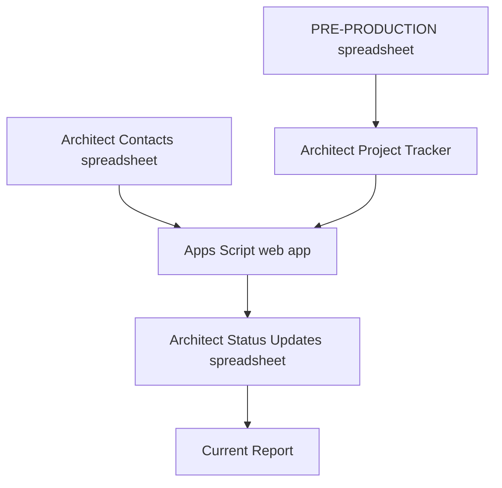

# Architect Update System

## Project Specification and Working Source of Truth

**Company:** Center Island Contracting  
**Status:** First consolidated draft  
**Prepared:** August 12, 2026  
**Proposed platform:** Google Sheets, Gmail, and a Google Apps Script web app

## 1. Purpose

Center Island Contracting needs a weekly system for collecting status updates from every architect assigned to an active pre-production project.

Every Monday, each architect receives one email containing a permanent private link. The link opens a page showing all current CIC projects assigned to that architect. The architect must provide either a written update or a **No change** response for every project, then submit all updates together.

The system must:

- Eliminate manual weekly follow-up
- Show CIC's current project and milestone information to the architect
- Collect a response for every active project
- Preserve all submissions and revisions
- Notify CIC when an architect submits or revises updates
- Flag missing weekly updates
- Generate a current internal report on demand

## 2. Confirmed Workflow

1. Projects are imported from the existing **PRE-PRODUCTION** spreadsheet.
2. Every project currently listed in PRE-PRODUCTION is considered active for architect updates.
3. Projects are matched to architects using the individual architect's exact name.
4. Office staff maintain proposal and milestone dates in a new architect project tracker.
5. Every Monday at 8:00 AM Eastern, each architect with at least one active project receives one email.
6. The primary contact receives the email. Other listed contacts are copied.
7. The email contains the architect's permanent private link. No Google sign-in is required.
8. The link opens one scrolling page with every assigned project card fully expanded.
9. Each project requires either:
   - A written status update, or
   - The **No change** checkbox
10. The architect submits all project responses using one **Submit All Updates** button at the bottom of the page.
11. The button remains disabled until every project has a valid response.
12. Updates are due Monday at 5:00 PM Eastern.
13. At 5:00 PM Monday, any architect who has not submitted receives an overdue email asking them to complete the page as soon as possible.
14. Architects can revise their submission at any time during the same week.
15. Every revision is retained with a timestamp. Earlier responses are never overwritten or deleted.
16. Submission and revision notifications are sent to `office@centerislandcontracting.com`.
17. When a project leaves PRE-PRODUCTION, weekly requests stop, but its complete history remains preserved.

## 3. System Architecture

The system consists of five components:

| Component | Type | Purpose |
|---|---|---|
| PRE-PRODUCTION | Existing company spreadsheet | Supplies the current project list and assigned architect |
| ARCHITECT PROJECT TRACKER | New spreadsheet | Stores imported project identity plus office-maintained proposal and milestone dates |
| ARCHITECT CONTACTS | Separate spreadsheet | Stores architect names, recipients, private-link records, and contact status |
| ARCHITECT STATUS UPDATES | New spreadsheet | Stores submission history, revisions, overrides, controls, and the current report |
| Architect Update Web App | Google Apps Script | Displays project pages, validates responses, sends emails, records submissions, and generates reports |

## 4. Project Inclusion and Identification

### 4.1 Active-project rule

- Every project currently present in PRE-PRODUCTION is active.
- A stage value does not control inclusion.
- A project leaving PRE-PRODUCTION stops appearing in future architect requests.
- Removing a project does not delete any project, submission, revision, or override history.

### 4.2 Project key

- **Client Name** is the unique project identifier.
- Client names will not be reused for multiple projects.
- Project type and town are stored separately and do not form part of the key.

### 4.3 Architect matching

- The source identifies the assigned architect by the individual's name.
- Architect names must match exactly between PRE-PRODUCTION, the project tracker, and the contact spreadsheet.
- Firm-level grouping does not apply.
- Unassigned projects appear in an **Unassigned** section on the Control tab.
- Name mismatches appear as errors on the Control tab.

## 5. Data Structure

### 5.1 ARCHITECT PROJECT TRACKER

The tracker separates imported fields from office-maintained fields. Imported fields should be protected from manual editing.

| Field | Maintained by | Purpose |
|---|---|---|
| Client Name | Imported | Unique project key |
| Project Type | Imported or office, pending source mapping | Used in the project title |
| Town | Imported or office, pending source mapping | Used in the project title |
| Assigned Architect | Imported | Routes the project to the correct architect |
| Present in PRE-PRODUCTION | System | TRUE while the project remains active |
| Source Last Seen | System | Last successful synchronization timestamp |
| Proposal Accepted | Office | Date the architect's proposal was accepted by the client or CIC |
| Site Visit | Office | Completion date |
| Prelims Received | Office | Completion date |
| Prelims Approved | Office | Completion date |
| CDs Received | Office | Completion date |
| CDs Approved | Office | Completion date |
| Application Sent to Building Department | Office | Completion date |
| Permit Received | Office | Completion date when CIC has received both a copy of the permit and a fresh copy of the approved plans with town stamp |
| Client Provided Plans | Office | Optional Yes/No flag; when Yes, the architect-facing milestone list is reduced to CDs Approved and Plans Submitted |
| Internal Notes | Office | Optional internal note that is never shown to architects |

### 5.2 ARCHITECT CONTACTS

Each row represents one individual architect.

| Field | Purpose |
|---|---|
| Architect Name | Exact name used for project matching |
| Primary Contact Name | Name automatically attributed to submissions from the permanent link |
| Primary Email | Recipient in the email **To** field |
| CC Emails | Other recipients copied on the email |
| Active | Controls scheduled email eligibility |
| Private Token Hash | Secures the permanent no-sign-in link |
| Token Created | Audit timestamp |
| Last Monday Email | Most recent successful Monday send |
| Last Reminder | Most recent overdue reminder |

Because the link requires no sign-in, the submitter name is an automatic attribution, not verified identity. Anyone with the link can access the page until the link is rotated.

### 5.3 ARCHITECT STATUS UPDATES

The spreadsheet contains these working tabs:

| Tab | Purpose |
|---|---|
| UPDATE LOG | Append-only history with one row per project response for every submission or revision |
| MANUAL OVERRIDES | Office-entered display overrides and their replacement history |
| CONTROL | Synchronization status, unassigned projects, email status, response status, errors, and report controls |
| CURRENT REPORT | Permanent on-demand report rebuilt in place |

### 5.4 UPDATE LOG fields

| Field | Purpose |
|---|---|
| Submission ID | Groups all project responses from one Submit All action |
| Week Start | Monday date for the reporting week |
| Submitted At | Eastern timestamp |
| Revision Number | Starts at 1 and increases for each revision that week |
| Architect Name | Architect record associated with the permanent link |
| Submitter Name | Primary contact name applied automatically |
| Client Name | Unique project key |
| Response Type | Written Update or No Change |
| Update Text | Written response, blank only for No Change |
| Documents Needed for Permit | Optional note identifying documents CIC or the client still needs to provide for permitting |
| Display Update After Submission | Substantive update selected by the display rules |
| Replaced Override ID | Override replaced by a new written architect update, when applicable |
| Submission Metadata | Optional technical audit information supported by Apps Script |

## 6. Architect Page

### 6.1 Overall page layout

- One permanent page per architect
- No sign-in
- All project cards fully expanded
- One continuous scrolling page
- One **Submit All Updates** button at the bottom
- Responsive layout for desktop, tablet, and mobile
- Desktop cards use a two-column layout with milestones on the left and update information on the right
- Mobile cards stack the milestone table above the update controls

### 6.2 Page header

The top of the page should show:

- The official Center Island Contracting horizontal logo and company-name treatment used in the header of `centerislandcontracting.com`
- Website-matched header colors, typography, spacing, and visual hierarchy
- Architect name
- Reporting week
- Monday 5:00 PM Eastern deadline
- Current submission status
- Clear instruction to update every listed project

The square **CIC** placeholder shown in the prototype must be removed. The architect portal should use the approved horizontal white website logo, currently published at:

`https://centerislandcontracting.com/wp-content/uploads/2025/07/logo-center-island-white-h.png`

The production build should use an approved stable copy or the official CIC-hosted asset so a future website change does not unexpectedly break the portal header.

### 6.3 Project-card title

Each card uses this title format:

`Client Name (PROJECT TYPE - TOWN)`

Example:

`Smith, Joe (DORMER - EAST MEADOW)`

### 6.4 Project summary

Each card shows:

- Proposal Accepted date
- Days Since Acceptance
- Six read-only milestone rows
- Last substantive update text
- Last substantive update date
- Submitter name associated with the last substantive update
- **No change** checkbox above the new-update field
- Multiline status-update field
- Optional **Documents Needed for Permit** field for permit-related items CIC or the client must still provide
- Card completion status

### 6.5 Days Since Acceptance

- Calculated using calendar days
- Calculated from Proposal Accepted through the current date
- Updates automatically each day
- Remains blank when Proposal Accepted is blank

### 6.6 Milestone table

The standard milestone list is:

1. Site Visit
2. Prelims Received
3. Prelims Approved
4. CDs Received
5. CDs Approved
6. Application Sent to Building Department
7. Permit Received

For client-provided-plan projects, most standard design-phase status checks are not applicable to CIC. These projects show only:

1. CDs Approved
2. Plans Submitted
3. Permit Received

The system treats a project as client-provided-plan work when `Client Provided Plans` is set to Yes, or when the assigned architect value is exactly `Client Provided`.

`Permit Received` means CIC has received both the permit copy and a fresh copy of the approved plans with the town stamp. This is an internal office-maintained checkpoint.

Milestone behavior:

- All milestone dates are read-only for architects.
- Office staff enter and maintain the dates.
- A completed milestone displays a checkmark and its completion date.
- The first milestone without a completion date receives the blue highlight.
- Later incomplete milestones remain neutral.
- When all applicable milestones are complete, no row is treated as the next outstanding milestone.

### 6.7 Last-update display

The card shows the most recent substantive displayed update with:

- Update text
- Submission date
- Submitter name

A current-week **No change** response does not replace the substantive update text. It adds a clear current-week No change indicator.

### 6.8 Response controls

- The **No change** checkbox appears above the update field.
- Each project requires either a checked No change box or a nonblank written update.
- The Documents Needed for Permit field is optional and does not affect whether a project card is complete.
- Whitespace alone is not a valid written update.
- A project card displays **Complete** after it has a valid response.
- Individual cards do not have Submit buttons.
- The page-wide Submit All button remains disabled until every card is complete.

Recommended interaction rule for implementation:

- Checking **No change** disables the update field for that project.
- Entering a written update clears **No change**.
- The page explains which control must be changed if the user attempts an invalid combination.

This interaction rule is recommended but has not yet been explicitly approved.

### 6.9 Submit All behavior

When the architect selects **Submit All Updates**:

1. The system validates every currently displayed project.
2. One Submission ID is created for the full-page submission.
3. One log row is written for each project.
4. The office receives a submission notification.
5. The page displays a receipt with the submission timestamp and revision number.
6. The page remains available for revisions during the same reporting week.

## 7. Update, No Change, Revision, and Override Rules

### 7.1 Written updates

- A new written response becomes the project's latest substantive update.
- It appears on the architect page and CURRENT REPORT.
- If an active manual override exists, the new written response replaces it automatically.
- The replaced override remains in history.

### 7.2 No change

- No change counts as the project's required response for that week.
- The last substantive written update remains displayed.
- The current week is separately shown as **No change**.
- A No change response never erases or replaces the last substantive update.

### 7.3 Revisions

- Architects can revise updates at any time during the same week.
- Every revision creates new timestamped records.
- Prior versions remain preserved.
- The latest revision controls the current-week response shown in reports.

The exact end-of-week cutoff has not been explicitly approved. The proposed cutoff is Sunday at 11:59 PM Eastern.

### 7.4 Manual overrides

- Office staff enter overrides directly in ARCHITECT STATUS UPDATES.
- An active override controls the displayed last update until a new written architect update is received.
- A new written architect update automatically replaces the override.
- No change does not replace the override because it is not a substantive written update.
- All override activation and replacement timestamps remain in history.

### 7.5 Display precedence

For each project, the displayed substantive update follows this order:

1. Active office manual override
2. Most recent substantive written architect update
3. Blank state when neither exists

Current-week response status is displayed separately as Written Update, No Change, or Overdue.

## 8. Automated Synchronization

### 8.1 Requested behavior

Changes in PRE-PRODUCTION should automatically synchronize to the architect project tracker.

The synchronization must:

- Add new projects by Client Name
- Update imported project fields
- Update assigned architect changes
- Preserve all office-maintained dates
- Mark projects no longer present as inactive
- Never delete historical updates

### 8.2 Technical safeguard

Google Sheets edit triggers do not capture every change caused by formulas, imports, or other scripts. The recommended implementation uses:

- Immediate synchronization after eligible direct source edits
- A scheduled full reconciliation as a safeguard

The prior draft recommends nightly reconciliation. The exact safeguard schedule has not been explicitly approved.

## 9. Email Automation

All scheduled times use Eastern Time.

### 9.1 Monday request

- **Schedule:** Monday at 8:00 AM
- **To:** Primary email
- **CC:** All other listed contacts
- **Send rule:** Only architects with at least one current PRE-PRODUCTION project
- **Link:** Same permanent private link every week

**Subject:** Weekly project status updates requested by 5:00 PM today

**Draft body:**

> Good morning [Architect Name],
>
> Please use the link below to provide this week's status update for every active Center Island Contracting project assigned to you. The page includes our current milestone dates and the most recent update on file.
>
> [OPEN PROJECT UPDATE PAGE]
>
> Please submit all updates by 5:00 PM today. Select No change when there is no new information for a project.
>
> Thank you,  
> Center Island Contracting

### 9.2 Overdue reminder

- **Schedule:** Monday at 5:00 PM
- **Recipients:** Architects who have not submitted the full current-week page
- **Instruction:** Complete the updates as soon as possible

**Subject:** Architect updates overdue, please complete as soon as possible

**Draft body:**

> Good afternoon [Architect Name],
>
> We have not received this week's status updates for the Center Island Contracting projects assigned to you. Please complete the page as soon as possible.
>
> [OPEN PROJECT UPDATE PAGE]
>
> Thank you,  
> Center Island Contracting

### 9.3 Internal submission notice

- **To:** `office@centerislandcontracting.com`
- **Trigger:** Initial submission or any revision
- **Suggested subject:** Architect updates received from [Architect Name]

The notice should include:

- Architect name
- Automatically attributed submitter name
- Submission time
- Revision number
- Number of projects updated
- Number of projects marked No change
- Link to ARCHITECT STATUS UPDATES

## 10. Reporting

### 10.1 Report location and refresh

- The permanent report tab lives in ARCHITECT STATUS UPDATES.
- The tab is named **CURRENT REPORT**.
- Staff refresh it on demand using a clickable button on the **CONTROL** tab.
- Each refresh rebuilds the same permanent report tab.
- The report does not create dated tabs.

### 10.2 Organization

- Projects are grouped by architect.
- Only current PRE-PRODUCTION projects appear in the main current report.
- Each project without a valid response for the current week is individually marked **OVERDUE**.
- Historical projects and revisions remain available in the underlying logs.

### 10.3 Report columns

| Column | Contents |
|---|---|
| Architect | Group heading or row value |
| Client Name | Unique project key |
| Project Type | Project category |
| Town | Project municipality |
| Proposal Accepted | Date |
| Days Since Acceptance | Current calendar-day count |
| Site Visit | Date |
| Prelims Received | Date |
| Prelims Approved | Date |
| CDs Received | Date |
| CDs Approved | Date |
| Application Sent to Building Department | Date |
| Permit Received | Date |
| Latest Displayed Update | Active override or latest substantive architect update |
| Latest Update Date | Timestamp of displayed update |
| Latest Update Submitter | Submitter associated with displayed update |
| Current Week Response | Written Update, No Change, or Overdue |
| Current Week Submitted | Latest current-week revision timestamp |
| Revision Number | Latest revision number for the week |

## 11. CONTROL Tab

The Control tab should include:

- **Refresh Current Report** button
- Last successful source synchronization
- Last full reconciliation
- Current active-project count
- Current active-architect count
- Unassigned-project section
- Architect-name mismatch section
- Monday email status by architect
- Reminder status by architect
- Current-week submission status by architect
- Last revision timestamp by architect
- Plain-language error log and resolution instructions

## 12. Access, Security, and Reliability

- Use a long cryptographically random token for each architect's permanent link.
- Store only the token hash in the contact spreadsheet.
- Allow CIC staff to rotate a link if it is forwarded or exposed.
- Display only the project information defined in this specification.
- Do not expose internal notes, client contact information, budgets, or unrelated projects.
- Escape sheet values before displaying them in HTML.
- Use submission locking to prevent partial or duplicate records.
- Write valid submissions to the log before sending notifications.
- An email failure must not erase a valid submission.
- Record scheduled sends, reminders, submissions, revisions, overrides, replacements, and synchronization errors.
- Deploy the web app under a CIC-controlled Google Workspace account.

### No-sign-in access limitation

The permanent link is private by possession, not verified identity. Anyone who receives the link can open that architect's page until CIC rotates the token. Automatically showing the primary contact as the submitter does not prove that person completed the form.

## 13. Responsibilities

| Owner | Responsibility |
|---|---|
| Office staff | Maintain proposal and milestone dates, correct assignments, manage contacts, enter overrides, review errors, and refresh reports |
| Architect | Review project information and provide a written update or No change for every project each week |
| System | Synchronize projects, send emails, validate submissions, preserve history, notify CIC, and generate reports |
| System administrator | Maintain the Apps Script deployment, triggers, permissions, sender account, and token rotation |

## 14. Acceptance Criteria

The system is ready for production when all of the following are true:

- A PRE-PRODUCTION project appears on the correct architect page after synchronization.
- A removed project stops appearing in future requests while its history remains available.
- Every permanent link shows only the projects assigned to its architect.
- Every project card is expanded on one scrolling page.
- Project titles use Client Name, Project Type, and Town.
- The page header uses the official Center Island Contracting horizontal logo and website branding rather than the prototype CIC placeholder.
- Days Since Acceptance uses calendar days.
- The six confirmed milestone rows appear in the correct order.
- Completed milestones show checkmarks and completion dates.
- The first milestone without a date receives the blue highlight.
- Architects cannot edit proposal or milestone dates.
- Last Update includes the text, date, and submitter name.
- The No change checkbox appears above the update field.
- No change preserves the last substantive update.
- A card becomes complete only after a written update or No change response.
- Submit All remains disabled until every card is complete.
- One Submit All action creates one Submission ID and one log row per project.
- Every revision creates a new timestamped record without deleting prior records.
- A new written architect update automatically replaces an active manual override.
- Monday request emails send at 8:00 AM Eastern.
- Nonresponding architects receive the Monday 5:00 PM overdue email.
- `office@centerislandcontracting.com` receives initial submission and revision notices.
- The Control-tab button rebuilds one permanent report grouped by architect.
- Every active project missing a current-week response is marked OVERDUE.

## 15. Required Configuration Before Development

The workflow and page behavior are substantially defined. Development still requires these source values:

| Configuration item | Reason |
|---|---|
| PRE-PRODUCTION spreadsheet URL or ID | Connect the source |
| Exact source tab name | Identify the project table |
| Source Client Name column | Establish the project key |
| Source Assigned Architect column | Route projects |
| Source Project Type column or office-entry rule | Build the card title |
| Source Town column or office-entry rule | Build the card title |
| Initial architect contact list | Populate names, primary recipients, copied recipients, and submitter attribution |
| Authorized office editors | Control internal date and override access |
| Sending Google Workspace account | Own the script and send email |
| Official CIC website logo and header styles | Apply the established `centerislandcontracting.com` branding to the portal |

## 16. Decisions Still Open

These items were not explicitly approved and should be settled before coding their final behavior:

- Exact end-of-week cutoff for revisions
- Exact schedule for full source reconciliation
- Whether checking No change disables and clears the written-update field
- What the page should display when all milestones are complete
- Whether Project Type and Town come from PRE-PRODUCTION or are maintained by office staff
- Final mobile refinements to the approved website-derived branding
- Final confirmation-page wording
- Final internal submission-notification format

## 17. Recommended Build Sequence

1. Create the three new spreadsheets and protect system-controlled fields.
2. Map the PRE-PRODUCTION columns.
3. Build and test project synchronization without sending email.
4. Load architect contacts and generate permanent private tokens.
5. Build the architect page using the approved project-card layout.
6. Add complete-card validation and Submit All behavior.
7. Add append-only submissions, revisions, No change logic, and overrides.
8. Add internal notifications.
9. Add Monday request and overdue-reminder emails in test mode.
10. Build the Control and Current Report tabs.
11. Test access, token rotation, duplicate prevention, and error recovery.
12. Run a closed pilot with one architect before activating all recipients.

## 18. Current Visual Direction

The supplied mockup establishes the intended project-card hierarchy:

- Rounded blue outer border
- Project title and acceptance timing at the top
- Compact milestone table on the left
- Last-update summary on the right
- No change control above a large update field
- Blue milestone highlight for the first incomplete milestone
- One page-level Submit All button after all project cards

The live prototype at `https://cic-architect-updates.evanl18172.chatgpt.site/` is the current visual reference, subject to these confirmed changes:

- Replace the square CIC placeholder with the official horizontal Center Island Contracting logo and website header treatment.
- Remove the architect-facing **System workflow overview** cards.
- Remove the architect-facing **What CIC staff can monitor** section and keep that information on the internal Control tab.
- Correct the sticky Submit All bar so it never overlaps a project card or its controls.
- Correct any state where a project says **Current week: No change submitted** while also showing **Needs response**.

The mockup is a structural reference. Final implementation should preserve its information hierarchy while applying the established CIC website branding and improving responsive behavior, spacing, validation feedback, and accessibility.
